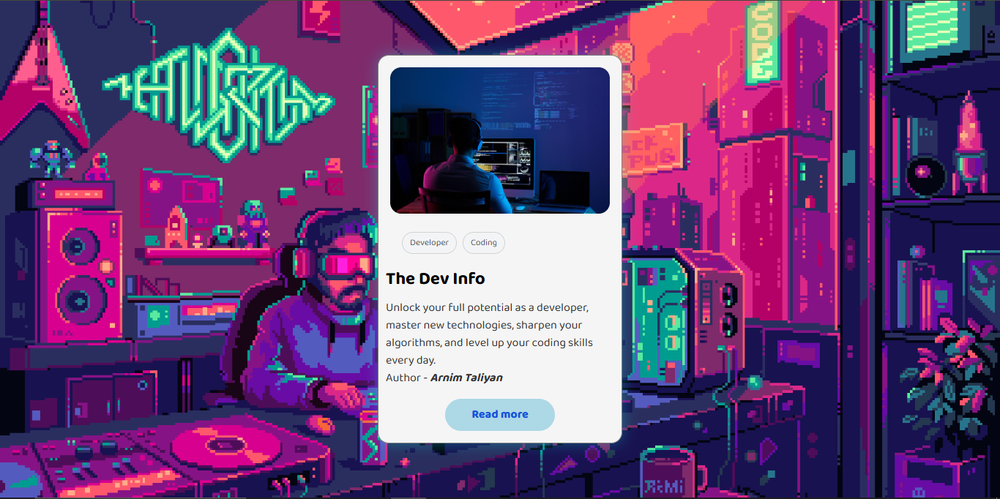

# The Dev Info Card

A responsive developer profile card built with HTML and CSS. Showcasing clean UI, a pixel-art background, and a professional profile card layout.

## 🔍 Preview

## ✨ Features
- Responsive layout
- Clean design with modern CSS
- Developer-themed content
- Pixel-art background

## 🛠 Technologies Used
- HTML5
- CSS3

## 📌 Author
**Arnim Taliyan**

## 🎨 Credits

- **Background GIF**:  
  ["Coding" by Pixel Jeff](https://www.reddit.com/r/Cyberpunk/comments/17orhba/coding_by_pixel_jeff/)  
  Posted on [Reddit - r/Cyberpunk](https://www.reddit.com/r/Cyberpunk)  
  > All rights belong to the original artist. Used here for educational and non-commercial purposes only.  
  > If you're the creator and would like it removed or properly attributed, please contact me.